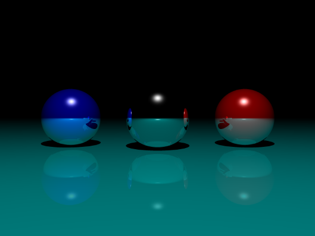

# Raytracing Java

A sophisticated 3D raytracing engine implemented in Java. This project demonstrates ray casting and intersection algorithms to render 3D scenes with realistic lighting, reflections, and anti-aliasing capabilities.

## Overview

This raytracing engine computes the path of light rays through a 3D scene to generate photorealistic images. It supports multiple geometric primitives, dynamic light sources, reflective surfaces, and anti-aliasing for smooth image rendering.

## Example Output



*Sample render produced by the raytracing engine showing reflective spheres with realistic lighting and shadows.*

## Project Structure

The project is organized into the following main modules:

### `model/` - Geometric Primitives
- **`Model.java`** - Abstract base class defining the interface for all 3D objects
- **`Sphere.java`** - Spherical objects with support for radius, position, color, and reflection coefficients
- **`Plan.java`** - Planar surfaces used for walls, floors, and environmental boundaries

### `raytracing/` - Core Ray Tracing Engine
- **`Scene.java`** - Main scene management class that orchestrates the raytracing process:
  - Renders the scene to a 2D image buffer
  - Manages light sources and object interactions
  - Implements ray-object intersection detection
  - Handles reflection calculations and surface shading
- **`LightSource.java`** - Defines point light sources that illuminate the scene with configurable intensity and color

### `render/` - Image Export
- **`RenderTga.java`** - Handles saving the rendered scene as a TGA (Truevision Graphics Adapter) image file for compatibility with standard image viewers

### `utils/` - Utility Classes
- **`Vec3f.java`** - 3D vector mathematics library providing:
  - Vector arithmetic (addition, subtraction, multiplication)
  - Dot and cross products
  - Normalization and magnitude calculations
  - Essential for ray direction, position, and color calculations

### `main.java` - Application Entry Point
The main class provides an interactive scene selection system with 5 pre-configured use cases.

## How It Works

1. **Scene Setup** - A 3D scene is constructed with geometric objects (spheres and planes), light sources, and material properties

2. **Ray Casting** - For each pixel in the output image:
   - A ray is cast from the camera through the pixel
   - The ray is tested for intersections with all scene objects
   - The closest intersection point is determined

3. **Shading & Lighting** - At each intersection point:
   - Direct lighting from all light sources is computed using the Phong or Lambert shading model
   - Surface normals determine the angle of incidence
   - Reflection coefficients control how much light bounces off reflective surfaces

4. **Reflection** - For reflective surfaces:
   - Secondary rays are traced from the intersection point
   - Recursive reflections create mirror-like effects

5. **Anti-aliasing** - Multiple samples per pixel are averaged to eliminate jagged edges and improve image quality

6. **Image Rendering** - The final color buffer is exported as a TGA image file

<!-- ## Usage

Run the program with a scene number argument:
<!-- 
```bash
java main <scene_number>
``` -->

### Available Scenes

The program includes **5 pre-configured example scenes**:

1. **Scene 1: Reflective Room with Spheres**
   - Two reflective spheres in a complete room environment
   - The left wall acts as a mirror
   - Multi-colored walls: green background, blue right wall, cyan ceiling and floor
   - Light source positioned at (10, 1, 1)

2. **Scene 2: Single Blue Sphere**
   - One blue sphere at position (0, 0, -4)
   - Single light source at (-10, 5, 5)
   - Simple scene for basic rendering tests

3. **Scene 3: Sphere and Backwall with Dual Lighting**
   - Green sphere at (0, 0, -10)
   - Reddish backwall at (0, 0, -40)
   - Two light sources at (10, 0, 0) and (-10, 0, 0) for balanced illumination

4. **Scene 4: Three Spheres with Reflective Floor**
   - Three colored spheres: black, red, and blue
   - Yellowish-green reflective floor
   - Overhead light source at (0, 7, 0)
   - All objects support reflections

5. **Scene 5: Green Sphere on Reflective Floor**
   - Single green/yellow sphere at (0, 0, -10)
   - Reflective black floor plane below
   - Light source at (0, 10, -10) for dramatic lighting

<!-- ### Help

Display information about available scenes:

```bash
java main -h
``` -->

## Features

- **Ray-Object Intersection** - Accurate sphere and plane collision detection using analytical geometry
- **Dynamic Lighting** - Multiple configurable point light sources with variable intensity
- **Surface Reflection** - Support for reflective surfaces with configurable reflection coefficients
- **Anti-aliasing** - Configurable multi-sample rendering for smooth, high-quality output
- **TGA Export** - Direct image export to standard TGA format for universal compatibility

## Output

The program generates a `raytracing_scene.tga` file containing the rendered image (800x600 resolution by default).